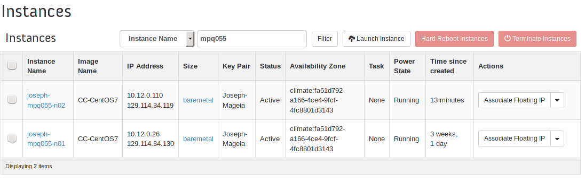

# Introduction
This document serves as a collection of an ongoing series of tutorials authored for Docker and services surrounding Docker on the Chameleon Cloud platform. Spanning topics from basic installation to creating customized Docker applications that run across multiple hosts, these sections are designed to serve as a starting point from which users can create their own container-based applications.

This document also covers Kubernetes, a solution that uses Docker containers across a wide variety of hosts to offer a resilient and reliable solution for applications. We demonstrate both Kubernetes and Docker's native solution so users can make a knowledgeable choice about which solution is best. We start with an in-depth look at some of the technologies underlying Docker that enable additional features in management and security.

# Section 1: Docker Fundamentals

## In the Beginning / The Need for Containers
TODO give history of the need for and rise of virtualization, and how we got to containerization.

## Linux Architecture Features and Concepts
Being one of the leaders in the container-based world, Docker often takes advantage of several features belonging to the Linux kernel as a means to better its service. In particular, Docker's use of namespaces and control groups (cgroups) and how each play a role in resource management and security cannot be overlooked. In order to understand what Docker provides through these features, one must first understand what they accomplish individually.

### Namespaces
To start off with, namespaces are a very convenient feature of Linux that serves to provide a somewhat virtualized resource that acts as a go between for processes within the group and the actual resources. By sectioning off these processes into their own groups, they are unable to see the resources being used by separate groups while still remaining visible to those processes within the same group. Using this allows users to segment things such as: Networking, PIDs, Users, Mounts, and more. Essentially, the process will have no knowledge of processes outside of its group and would have no need to know about them, providing an isolated bundle of processes.

When applying this knowledge towards the implementation with Docker, the advantages then become clear in the form of containers and linked-containers being permitted to run on the same host, but oblivious about any other running containers. Docker, by default, will separate a newly created container into its own namespace to distance containers from one another. This is done across most of the namespaces listed before and allows the container to act as a solo application on the host.

Like many other Linux features, namespaces establish themselves using a virtual filesystem in the fashion of `/proc/$PID/` (where `$PID` is the pid of the process). Within this directory, Linux already displays intimate information about processes, but with namespaces, there is additional information available. Primarily through the `ns` directory (namespaces) which holds file handles pointing to the corresponding namespace. Additionally, within other directories such as `mounts` and `net`, even more information about the current namespaces are available. Given that one of the core goals of a container was to replace the need for virtual machines, namespaces provide an opportunity to bridge the gap through process isolation. Thus giving the appearance of each as having their own virtual machine.

This usage of namespaces plays hand-in-hand with cgroups and their many uses.

### CGroups
When speaking about cgroups, the first idea that should come to mind is of resource management. Because where cgroups excels is in an area similar to namespaces, by separating and grouping processes into whatever organizations the user prefers and inflicting global (group-wide) rules upon them. Cgroups provide a kernel-level tool for resource management and accounting that is greatly relied upon by Docker and many other modern tools. Beginning with the organization, processes are organized into cgroups based first and foremost off of inheritance. That is, child processes will inherit their initial group based off the parent group they belong to. NOTE: Only certain properties are inherited from parent cgroups that can also be modified upon child process creation. Cgroups are used to divide up the resources of a system into separate catagories that can be described in terms of limits and shares among the host resources. The first and most prevalent example is the sharing of the CPU amongst different processes. Initially, one might think to allocate a certain number of cores to system processes and leave the rest for userspace processes (assuming the system contains enough cores). From there, the user processes may spawn a webserver which would be placed in its own cgroup along with its children so that they only use a certain percentage of the CPU time, RAM, I/O, Network, etc. These limitations and rules are used to define the resource behavior of programs within their cgroups so that each has their "fair share".

Much like with CPU scheduling, cgroups are often used to evenly distribute resources amongst its processes, but the difference is that it does not need to be equal. For example, when running unfamiliar applications, one thought might be to run all user-level programs in their own cgroup so as to limit their usage of the system resources to a certain extent such that they won't be able to monopolize and steal away these resources from the system. Whether the exhaustion of a resource is intentional or accidental, cgroups provide a safety barrier (similar to that of saving 5% of the hard disk for root) that can be used for the safety of the host as a whole.

In terms of how Docker uses cgroups is that Docker will place all the containers, unless told otherwise, into their own cgroup that are each set to equally share the system resources. However, by passing in certain arguments, one can raise the priority of certain containers, lower the I/O permitted by others, and all around customize to the best efforts of the system. Additionally, since cgroups occur at the system level, none of the applications will ever need to be aware that they are being throttled or administrated over in any way, again providing the illusion of each container belonging on its own host.

Similar to the namespaces, cgroups manifest themselves in the virtual filesystem. Depending on your installation, they are often found at `/sys/fs/cgroup/` or `/cgroup/`. From this root directory, you can see each subsystem has its own directory within which you can create cgroups within. Aside from that, you are also capable of mounting a cgroup and assigning the subsystems desired to be nested within using the `mount` command. Cgroups subscribe to a hierarchical structure in order to create nested groups of related tasks such that related processes can be stored together. This can be extended to running all tasks related to the webserver within one cgroup, internally, creating different cgroups for the database, backend, etc.

## Containers
Containers include the application and all of its dependencies, but share the kernel with other containers. They run as an isolated process in userspace on the host operating system. They’re also not tied to any specific infrastructure – Docker containers run on any computer, on any infrastructure and in any cloud <https://www.docker.com/whatisdocker>.

![Image of container]
(https://www.docker.com/sites/default/files/what-is-vm-diagram.png "Containers working on top of host operating system ")


## Using Docker
Docker is conceptually similar to virtual machines but has much less resource overheard because it doesn't run a full guest OS. Docker containers start in seconds vs minutes, take up less space, and are less hardware demanding because they share resources with the host OS.
<https://www.docker.com/whatisdocker>.

### Terms and Concepts
Most of the docker descriptions are taken directly from their glossary.
<https://docs.docker.com/reference/glossary/>.

**Docker Engine or "Docker":** The docker daemon process running on the host which manages images and containers

**Image:** Docker images are the basis of containers. An Image is an ordered collection of root filesystem changes and the corresponding execution parameters for use within a container runtime. An image typically contains a union of layered filesystems stacked on top of each other. An image does not have state and it never changes.

**Docker Hub:** The Docker Hub is a centralized resource for working with Docker and its components. Like GitHub but for Docker images.

**Container:** A container is a runtime instance of a docker image. A Docker container consists of:

- A Docker image
- Execution environment
- A standard set of instructions
- The concept is borrowed from Shipping Containers, which define a standard to ship goods globally. Docker defines a standard to ship software.

**Dockerfile:** A Dockerfile is a text document that contains all the commands you would normally execute manually in order to build a Docker image. Docker can build images automatically by reading the instructions from a Dockerfile. <https://docs.docker.com/reference/builder/>

### Image Repositories / Docker Hub
Docker provides the Docker Hub service to host and build images. Users create Docker images and push them to Hub for others to use and expand on. Hub also allows for automated builds. Automated builds link to a repo (GitHub or Bitbucket) and build an image on Hub servers using files from the repo automatically as you push.

Images fulfill different needs and workflows. System images are useful to build off or provide an environment to work in. Processing-type images take input files and produce processed output files. One-off images run some predetermined task and generate a result or success message. We'll look at specific examples below.

**System Images**  
Docker can be used to quickly launch into a particular Linux distro environment. For example to launch into a Bash shell on Ubuntu, run `docker run -it ubuntu /bin/bash` or `docker run -it -v $(pwd):/working` (if you need to save work). The `-v $(pwd):/working` argument mounts the current directory inside the container at `/working`. System images are also used as the base for other images. To do this you specify a system image in the `FROM` tag of a Dockerfile.

**Processing Images**  
A common workflow with containers is performing some operation or conversion on an input file. For example this document is written in markdown and needs to be converted to pdf. For this we have a container with Pandoc installed. The command to use it is:

```
docker run --rm -it -v $(pwd):/working cloudandbigdatalab/pandoc \
pandoc \
-V geometry:margin=1in \
--latex-engine=xelatex \
--toc \
-f markdown_github \
-o /working/docker-combined.pdf \
https://raw.githubusercontent.com/cloudandbigdatalab/cloudandbigdatalab.github.io\
/master/docker-combined.md
```

**One-Off Images**
The one-off workflow consists of running a container to produce some output or do some task with no input. For example generating part of a number series. Generating a Swarm token is a more practical example. Docker Swarm is explained later on but for now just know a token is something used to link nodes of swarm together. Run `docker run --rm -it swarm create` and your token is printed to stdout.

## Tutorial
In this tutorial we're going to guide you through the fundamentals of using Docker on Chameleon Cloud. You should already be familiar with managing resources on Chameleon Cloud, if not follow the "Getting Started" tutorial. At the end of this tutorial you will have setup a demo website utilizing 5 Docker containers and 2 physical hosts. See the official Docker docs for more detail and reference. <https://docs.docker.com/>

The following are the tools used in this tutorial:
**Postgres:** An SQL database. <http://www.postgresql.org>

**Nginx "engine x":** A web server. <http://nginx.com>

**uWGSI:** An application server that connects to Nginx. In our tutorial we're using it to run a simple Python app that generates the demo page. <https://uwsgi-docs.readthedocs.org/en/latest/>


### Steps Outline

\# | Description | Time (mins)
---|-------------|------------
1 | Spin up Chameleon resources | 10
2 | Software installation | 10
3 | Setup containers, Postgres on host 1, Nginx and uWSGI on host 2 | 10
4 | Test demo site to see if configuration was successful | 1

### Step 1: Chameleon Resources
Create 2 Chameleon baremetal servers. We used a CentOS 7 image for this tutorial but feel free to use any other distro as long it runs Docker.

### Step 2: Software Installation
Install Docker on each server with `sudo yum install docker`. This installs the Docker daemon and client tools. You may also wish to install an editor such as vim and git (if not already installed, included in our CentOS image).

The Docker daemon needs to be running before you can use Docker. Start it with `sudo service docker start`. If you're getting errors with every Docker command this may be the cause.

### Step 3: Container Setup
Before you move on let's explain some things. You will be setting up one host with a Postgres (SQL database) container. The other host will be setup with Nginx (web server) and uWGSI (interface to Python script that generates actual page) containers. To connect the uWGSI container across hosts to the Postgres container we will use *ambassador* containers, one on each host.  

**Note**  
You have two options to deploy the containers. You can pull already built containers from our cloudandbigdatalab Docker Hub and run them. Or you can pull this GitHub repo and build the Docker images yourself using the Dockerfile in each directory. If you want to edit the site content you will need to build the images yourself after making your edits, although you can edit the database by simply connecting to it. The ambassador containers we're using are maintained by a Docker employee and thus we'll only be pulling those. You can pull an image before running it with `sudo docker pull image_name` or you can  just `sudo docker run --name container_name -d image_name` and Docker will automatically pull the image for you.
<https://hub.docker.com/u/cloudandbigdatalab/>

**Useful Commands**
```sh
# show running containers
sudo docker ps

# show all, even stopped, containers
sudo docker ps -a

# check container's logs (stdout of container)
# useful if there's a problem
sudo docker logs container_name

# to stop container
sudo docker stop container_name_or_id

# to remove container
sudo docker rm container_name_or_id

# to remove and stop together
sudo docker rm -f container_name_or_id

# to remove image
sudo docker rmi image_name_or_id
```

#### Host 1

##### Pulling from Docker Hub
```sh
# start postgres container
# port 5432 is set to be exposed in Dockerfile
# -d run as daemon (run in background)
# user: cloudandbigdatalab, repo: postgres
sudo docker run --name postgres -d cloudandbigdatalab/postgres

# start ambassador container, linking to postgres
# -p map port 5432 from within container to outside
sudo docker run --name host2_ambassador -d \
--link postgres:postgres \
-p 5432:5432 \
svendowideit/ambassador
```

##### Building from Dockerfile
```sh
# clone repo
git clone https://github.com/cloudandbigdatalab/tutorial-cham-docker-1.git

# move into postgres directory
cd postgres

# build postgres image
# -t to name
# . is path to Dockerfile
sudo docker build -t postgres .

# from here you run the same commands as if you pulled the images
# EXCEPT change cloudandbigdatalab/image_name to image_name
```

#### Host 2

##### Pulling from Docker Hub
**Note**  
You will need to replace the ip in one of the following commands. If you need to restart the uwsgi container you will need to rm both the uwsgi and nginx containers then run again. The uwsgi container must be run first.

```sh
# start ambassador container
# --expose port 5432 (postgres default) to linking containers
# -e sets environment variable for postgres, shared to linked containers
# replace host1_local_ip with local ip of your host 1 instance

sudo docker run --name host1_ambassador -d \
--expose 5432 \
-e POSTGRES_PORT_5432_TCP=tcp://host1_local_ip:5432 \
svendowideit/ambassador

# start uwsgi container, linking to host1_ambassador
sudo docker run --name uwsgi -d \
--link host1_ambassador:postgres \
cloudandbigdatalab/uwsgi

# start nginx container, linking to uwsgi container
# map port 80 to outside, http default port
sudo docker run --name nginx -d \
--link uwsgi:uwsgi \
-p 80:80 cloudandbigdatalab/nginx
```

##### Building from Dockerfile
```sh
# clone repo
git clone https://github.com/cloudandbigdatalab/tutorial-cham-docker-1.git

# move into uwsgi directory
cd uwsgi

# build uwsgi image
# -t to name
# . is path to Dockerfile
sudo docker build -t uwsgi .

# move into nginx directory
cd ../nginx

# build nginx image
sudo docker build -t nginx .

# from here you run the same commands as if you pulled the images
# EXCEPT change cloudandbigdatalab/image_name to image_name
```

### Step 4: Test Website

Visit the public ip of your host 2 instance in your browser. If it worked congratulations!

# Section 2: Machine, Compose, and Swarm

## Machine
Machine allows us to create Docker hosts and control them without interacting with the host machines directly. This way you don't have to SSH to machines running the Docker daemon to run containers. Chameleon won't work for this part of the tutorial because of problems with Chameleon's lease system. Support for Chameleon will likely happen in the future. See the issue on their GitHub (linked below). You could also use virtual machines running on a Chameleon instance but we ran into issues installing VirtualBox on the default Chameleon CentOS image. So for now we're going to demo Machine with Rackspace to give you an idea of its potential. **We will be controlling everything from a Chameleon machine however.**
<https://github.com/docker/machine/issues/1461>

## Compose
Compose simplifies the process of arranging and linking containers together. Compose lets us specify the links and runtime configurations of containers in a single config file, rather than having several lengthy commands to execute in the right sequence. In the first tutorial we setup containers on 2 different hosts and linked them together to run a simple webpage. In this tutorial we will set up a similar page that lets you post messages and lists those previously posted. It uses 3 containers and we'll arrange them with Compose.

## Swarm
Swarm is used to group multiple Docker hosts together so that containers or groups of containers can scale across machines. We'll also be demoing this on Rackspace because we use Machine to setup our Swarm.

## Tutorial
**Because of incompatibilities, part of this tutorial uses Rackspace instead of Chameleon. See the Machine section for details.**

This tutorial will cover using Docker Machine, Compose and Swarm. Ultimately these tools are intended to be used together but because they're not yet mature that synthesis is limited. We'll discuss the limitations in more detail throughout the tutorial. We'll instead focus on using each tool individually and demonstrate them together in ways that currently work.

### Steps Outline
The whole tutorial (barring problems) will probably take 45 mins to an hour. It can take a long time to update your Chameleon instance and creating hosts with Machine can take a few minutes per host. How long your hosts take to create depends on the type and provider.

\# | Task | Approximate Time (mins)
---|-------------|------------
1 | Setup | 20
2 | Compose | 5
3 | Machine | 10
4 | Swarm | 20

### Step 1: Setup
We'll be using the default Chameleon CentOS image for this tutorial.

```sh
sudo yum update -y

sudo yum install -y docker

sudo groupadd docker

sudo usermod -a -G docker cc

sudo systemctl start docker.service
```

We also created a user group `docker` and added the default `cc` user to it before starting the Docker daemon. **After logging out and back in you will no longer have to use sudo with the Docker client or tools.**

Install Machine and Compose following the linked instructions. **If you're getting "Permission Denied" using curl, run `sudo -i` to become root, run the commands, then `exit`.**
<https://docs.docker.com/machine/#installation>
<https://docs.docker.com/compose/install/>

If you're going to try to use Machine with Rackspace, VM's, or another provider follow they're docs to get setup.  It's fairly easy to complete the demo with VM's on your own physical machine.

### Step 2: Compose
With Compose you outline your container configuration and arrangement with a YAML file name docker-compose.yml. Our docker-compose.yml is linked below. This lays out the 3 container composition. In our docker-compose.yml we specify to pull out images from Docker Hub. All the resources, including the Dockerfile, to build these images is available on our GitHub. If you wanted to build the images yourself or make modifications, download the repo then change `image: cloudandbigdatalab/server:tutorial-2` to `build: ./server`to build and use a local image. We're assuming the Dockerfile for server is in the server folder within the current directory. You would do the same for the page container. Note for the db container we're using the unmodified Postgres image off Docker Hub so their isn't a folder for it. Here's a quick explanation of what's going on with our composition.
<https://github.com/cloudandbigdatalab/tutorial-cham-docker-2/blob/master/docker-compose.yml>
<https://github.com/cloudandbigdatalab/tutorial-cham-docker-2>

Container Name | Apps | Description
----------|------|------------
server | Nginx | handles http requests
page | uWSGI and Django | page generation
db | Postgres | database

#### Run the Composition
```shell
docker-compose -p tutorial up -d
```

`-p tutorial` specifies our project name. Otherwise it uses the name of the current directory. If the images had been changed and we wanted to run the updated versions we would run

```sh
docker-compose pull
docker-compose -p tutorial up -d
```

and the images would be pulled and our containers restarted.

Check your running containers.

```sh
docker-compose -p tutorial ps
```

The output should look similar to this.

```sh
Name                     Command               State              Ports
--------------------------------------------------------------------------------
--------
tutorial_db_1       /docker-entrypoint.sh postgres   Up      5432/tcp
tutorial_page_1     ./startup.sh                     Up      3031/tcp
tutorial_server_1   nginx -g daemon off;             Up      443/tcp,
0.0.0.0:80->80/tcp
```

Now if you visit the ip of your Chameleon machine in the browser you should see the page running.

### Step 3: Machine
So now we're going to do the same thing but we're going to run our composition on a Docker host we setup with Machine. As we outlined in the introduciton we can't use Machine to create hosts on Chameleon (or VM's) so we're using Rackspace.

#### Create a host
We have our account information in environment variables in this example. `-d rackspace` specifies the *driver* as Rackspace. This will take several minutes.

```sh
docker-machine create -d rackspace docker-main
```

#### Point Docker at Remote Machine
```sh
eval "$(docker-machine env docker-main)"
```
Now if we run `docker ps` the 3 containers our gone because we're looking at the remote host.

#### Run Composition on Remote Host
The commands are exactly the same as before.

Run composition.

```sh
docker-compose -p tutorial up -d
```

Check our running containers.

```sh
docker-compose -p tutorial ps
```

To see the ip of our remote machine.

```sh
docker-machine ip docker-main
```

Then if you visit the ip in the browser you should see the same page as before. Note that the top left string on the page is the id of the page container. It will be different from before.

### Step 4: Swarm
As noted in the introduction we'll be using Rackspace for this part of the tutorial as well. It is possible to manually setup a Swarm cluster of Chameleon Docker hosts but we won't be doing that here. We'll be using Machine which simplifies the process.

#### Our Composition
For this demo we can't really use the multi-container setup we used earlier. This is for two reasons:

1. Currently linked containers must be run on the same host. This defeats the point of Swarm. Docker's networking is being overhauled to allow cross-host links and the feature is available in experimental builds. We were unable to get it working at the time of this writing however.

2. Even with cross-host linking, there's no automatic proxying or load balancing. So if for example we scaled the page container to 10, that's easy enough. But we'd also have to configure Nginx to load balance between those containers. Or we could have a proxy container in between the two. This is all possible but again we didn't get it working at the time of this writing. This is something you must build into your app design, there's no automatic mechanisms for this as of yet.

We're still using an (extremely sparse) docker-compose.yml for this. It consists of one service / container that runs folding@home. We're going to run it and scale it across a few nodes.
<https://github.com/cloudandbigdatalab/tutorial-cham-docker-2/blob/master/swarm/docker-compose.yml>
<https://folding.stanford.edu>

#### Generate Swarm Token
We're generating the token and saving to an environment variable.

export SWARM_TOKEN=$(docker run swarm create)

#### Swarm Master
Again the account information needed for Rackspace is stored in environment variables. Creating the machine will a few minutes.

```sh
docker-machine create -d rackspace --swarm --swarm-master \
  --swarm-discovery=token://$SWARM_TOKEN docker-swarm-master
```

#### Swarm Nodes
Here we're using a bash loop to create 2 nodes.

```sh
for ((i = 0; i < 2; i++)); do \
  docker-machine create -d rackspace --swarm \
    --swarm-discovery=token://$SWARM_TOKEN docker-swarm-node-$i; \
done
```

#### Point Docker at Swarm
Now we're going to point the Docker client at our Swarm cluster.

```sh
eval "$(docker-machine env --swarm docker-swarm-master)"
```

We can see info about the swarm with

```sh
docker info
```

which should output something like this.

```sh
Containers: 4
Images: 3
Storage Driver:
Role: primary
Strategy: spread
Filters: affinity, health, constraint, port, dependency
Nodes: 3
 swarm-master: 104.130.134.163:2376
  └ Containers: 2
  └ Reserved CPUs: 0 / 1
  └ Reserved Memory: 0 B / 1.014 GiB
  └ Labels: executiondriver=native-0.2, kernelversion=3.13.0-37-generic,
  operatingsystem=Ubuntu 14.04.1 LTS, provider=rackspace, storagedriver=aufs
 swarm-node-0: 104.130.134.175:2376
  └ Containers: 1
  └ Reserved CPUs: 0 / 1
  └ Reserved Memory: 0 B / 1.014 GiB
  └ Labels: executiondriver=native-0.2, kernelversion=3.13.0-37-generic,
  operatingsystem=Ubuntu 14.04.1 LTS, provider=rackspace, storagedriver=aufs
 swarm-node-1: 104.130.134.76:2376
  └ Containers: 1
  └ Reserved CPUs: 0 / 1
  └ Reserved Memory: 0 B / 1.014 GiB
  └ Labels: executiondriver=native-0.2, kernelversion=3.13.0-37-generic,
  operatingsystem=Ubuntu 14.04.1 LTS, provider=rackspace, storagedriver=aufs
Execution Driver:
Kernel Version:
Operating System:
CPUs: 3
Total Memory: 3.041 GiB
Name:
ID:
Http Proxy:
Https Proxy:
No Proxy:
```

#### Run Composition
Note that you need to download the docker-compose.yml into a different directory from earlier and run Compose from there.

```sh
docker-compose -p tutorial up -d
```

If we run

```sh
docker-compose -p tutorial ps
```

and look at the output we see a single worker container running.

```sh
Name                     Command               State   Ports
------------------------------------------------------------------
tutorial_worker_1   /bin/sh -c /etc/init.d/FAH ...   Up
```

We can scale our *worker* service to 6.

```sh
docker-compose -p tutorial scale worker=6
```

Now if we run `docker-compose -p tutorial ps` again and look at the output we should see multiple worker containers running.

```sh
Name                     Command               State   Ports
------------------------------------------------------------------
tutorial_worker_1   /bin/sh -c /etc/init.d/FAH ...   Up
tutorial_worker_2   /bin/sh -c /etc/init.d/FAH ...   Up
tutorial_worker_3   /bin/sh -c /etc/init.d/FAH ...   Up
tutorial_worker_4   /bin/sh -c /etc/init.d/FAH ...   Up
tutorial_worker_5   /bin/sh -c /etc/init.d/FAH ...   Up
tutorial_worker_6   /bin/sh -c /etc/init.d/FAH ...   Up
```

If we run `docker ps` we can look at the `NAMES` field and see that our containers our spread across the 3 hosts in our cluster.

```sh
CONTAINER ID        IMAGE                        COMMAND                CREATED
             STATUS              PORTS               NAMES
faadba6dff79        jordan0day/folding-at-home   "/bin/sh -c '/etc/in   About a
minute ago   Up About a minute                       
swarm-master/tutorial_worker_6
3457647206b0        jordan0day/folding-at-home   "/bin/sh -c '/etc/in   About a
minute ago   Up About a minute                       
swarm-node-1/tutorial_worker_5
97daf03f52c2        jordan0day/folding-at-home   "/bin/sh -c '/etc/in   About a
minute ago   Up About a minute                       
swarm-node-0/tutorial_worker_4
fd381b18544e        jordan0day/folding-at-home   "/bin/sh -c '/etc/in   About a
minute ago   Up About a minute                       
swarm-master/tutorial_worker_3
c2edd0380540        jordan0day/folding-at-home   "/bin/sh -c '/etc/in   About a
minute ago   Up About a minute                       
swarm-node-1/tutorial_worker_2
8ddadc49ec72        jordan0day/folding-at-home   "/bin/sh -c '/etc/in   2
minutes ago        Up 2 minutes                            
swarm-node-0/tutorial_worker_1
```

#### Cross-Provider Swarm
You can also setup a Swarm cluster across different providers. For example we could have launched one of our containers on Digital Ocean with:

```sh
docker-machine create -d digitalocean --swarm \
  --swarm-discovery=token://$SWARM_TOKEN docker-swarm-node-<i>;
```

and have a mixed cluster. In testing this worked just as well as if when they were on the same provider.

### Conclusion
Docker intends for Compose, Machine, and Swarm to work together to enable simple yet powerful workflows. The experience of putting this tutorial together shows that's not reality today. However, Compose and Machine work pretty well on their own barring Machine's Chameleon incompatibility. The synthesis between Compose and Machine is also solid right now. Swarm is problematic and not as useful as one might initially think. But Docker does disclaim that these tools are not production ready yet. In the future they should work better for multi-container apps and services.

# Section 3: Kubernetes

## Tutorial

### Objectives
In this tutorial, you will be walked through the basic installation of Kubernetes on the currently available CentOS images provided by Chameleon. Following installation, the guide will continue on to explain the basics and advanced usage of Kubernetes.

-------------------------------------------------------------------------------
\#  Action                     Detail                                Time (min)
--- -------------------------- ------------------------------------- ----------
 1  Setting Up Kubernetes      To begin, users will be shown the          5
                               steps necessary to install
                               Kubernetes on a Chameleon Bare Metal
                               Server.

 2  Simple Uses of Kubernetes  Here, users will be demonstrated the       5
                               several different uses of Kubernetes
                               ranging from simple deployments to
                               creating Services to run a web
                               service.

 3  Using Setup Files With     Finally, we will demonstrate how to        5
    Kubernetes                 create files that will setup an
                               application for us to build up and
                               tear down at will.
-------------------------------------------------------------------------------

### Prerequisites
The following prerequisites are expected for successful completion of this tutorial:

-   A Chameleon user account

-   An active project in the Chameleon Dashboard with appropriate administrative permissions.

-   Two active instances accesible by one another through a network connection.

### Step 1: Setting Up Kubernetes
Kubernetes is a system used to control a wide number of hosts for the purpose of deploying and managin containerized applications. In our specific setup, we will be using Kubernetes in association with Docker to serve as our application container system. The fundamental idea behind Kubernetes, beyond the setup stage, is that, as the user, there is no need to know about which host an application is running on. This serves the purpose of requiring the user to only need to focus on the application and not have to worry about the specifics of the host or management.

The setup of Kubernetes relies on a single host serving as a **Master** that will serve as the primary controller that will manage the Kubernetes installation. Any additional hosts that are to be used for application deployment are defined as a **Node** (previously described as a **Minion** in prior documentation). For the tutorial, the design will be to assign one single instance as the Master and the second as the Node.

**NOTE: At the time of this writing, Kubernetes is currently in a beta state. This means that the design is constantly evolving and subject to change, possibly invalidating parts of this tutorial, though the general idea should remain the same throughout. To keep up to date with the latest on Kubernetes, please visit their current development site.
<https://github.com/googlecloudplatform/kubernetes>

For our purposes, this tutorial will begin with the installation of Kubernetes.

First, we need to visit the list of instances and find the two instances we wish to use for our installation.



Take note of the local area network ip addresses of each instance and decide which host will be the Master and which will be the Node. In this scenario, 10.12.0.26, will be appointed as the Master. 10.12.0.110 will be the Node.

Go ahead and connect to the Master instance to begin installation. Please note that the machines are being connected to through SSH using appropriate aliases as defined in ~/.ssh/config.

```sh
[bill@windows] ssh cloud
```

Once logged in, we need to install Kubernetes and etcd so that the instance may act as the Master. Using the yum package manager, install both packages.


```sh
[cc@joseph-mpq055-n01] sudo yum -y install etcd kubernetes
```

From here, the installation will have installed all the appropriate configuration files into the /etc/kubernetes/ directory that we will need to modify.

For the file **/etc/kubernetes/apiserver**, ensure the following lines are uncommented and edited to match what is shown:

```sh
KUBE_API_ADDRESS="--address=0.0.0.0"
KUBE_API_PORT="--port=8080"
KUBELET_PORT="--kubelet_port=10250"
```

In addition, add the following line to the end of the file (where kubernetes-master is replaced by the Master instance's local ip address e.g., 10.12.0.26 for our scenario):

```sh
KUBE_MASTER="--master=http://kubernetes-master:8080"
```

For the file **/etc/kubernetes/controller-manager**, edit the following line to reflect (where kubernetes-node is replaced by the Node instance's local ip address e.g. 10.12.0.110 in our scenario):

```sh
KUBELET_ADDRESSES="--machines=kubernetes-node"
```

Now, we will go through a similar process for the Node instance. Connect to the secondary instance.

Install kubernetes using yum.

```sh
[cc@joseph-mpq055-n02] sudo yum -y install kubernetes
```

Due to this instance being the node, the configuration files will need to be altered in a slightly different manner than previously with the master.

For the file **/etc/kubernetes/apiserver**, ensure the following line is uncommented and edited to match what is shown:

```sh
KUBE_ETCD_SERVERS="--etcd_servers=http://kubernetes-master:4001"
```

For the file **/etc/kubernetes/config**, ensure the following line is uncommented and altered to match what is shown:

```sh
KUBE_MASTER="--master=http://kubernetes-master:8080"
```

In addition, add the following line:

```sh
KUBE_ETCD_SERVERS="--etcd_servers=http://kubernetes-master:4001"
```

For the file **/etc/kubernetes/kubelet**, ensure the following lines are uncommented and edited to match what is shown:

```sh
KUBELET_ADDRESS="-address=0.0.0.0"
KUBELET_PORT="--port=10250"
KUBELET_HOSTNAME="--hostname_override=kubernetes-node"
KUBELET_API_SERVER="--api_servers=http://kubernetes-master:8080"
```

For the file **/etc/kubernetes/proxy**, ensure the following line is uncommented and edited to match what is shown:

```sh
KUBE_PROXY_ARGS="--master=http://kubernetes-master:8080"
```

On the Master (the first host), we need to restart the service in order for the configuration changes to take effect. Additionally, we will enable each service so that is will start at boot for the server.

```sh
for cmd in restart enable status; \
do sudo systemctl $cmd etcd kube-apiserver kube-scheduler \
kube-controller-manager; done
```

The Node (the second host) will also need to restart and enable similar services.

```sh
for cmd in restart enable status; \
do sudo systemctl $cmd kube-proxy kubelet docker; done
```

Now that all the services are enabled and restarted with the new configurations, we can now begin to manipulate and deploy across the Kubernetes cluster.

### Step 2: Simple Uses of Kubernetes
Now that we have the Kubernetes system in place, we can now use it to deploy applications. As mentioned before, the Master controls the entirety of Kubernetes, so each of these commands will be run on the Master host/instance that we set up previously. In our example, this would be the 10.12.0.26 machine. To start off with, we will take a look at the attached nodes using the followin command.

```sh
[cc@joseph-mpq055-n01] kubectl get nodes
NAME          LABELS                               STATUS
10.12.0.110   kubernetes.io/hostname=10.12.0.110   Ready
```

We can see the attached node at 10.12.0.110 showing that the Master recognizes the attached Node.

The command, **kubectl** (Kubernetes Control), is the primary command used to interact with Kubernetes and the attached cluster. Passing **get** to the command is similar to reading variables with the final argument being **nodes**, any and all attached nodes that are responding will be displayed the same as above. We will see this command used further in later examples.

For the next section, we will being talking about Pods. **Pods** are a container or group of containers that are typically meant to be run together to create a **Service**. There are a few main terms and concepts that need to be explained before advancing further.

To begin with, we must first go aobut defining what a **Pod** is in the Kubernetes environment. A pod is defined as a collection of any number of containers or applications that are to interact with one another as though they existed on the same machine. This is used in the same sense that a multi-container application would be used for within Docker alone. It is recommended that any and all applications that exist within a single pod be very tightly related to the point where it is almost a necessity that they exist on the same host. Typically, the more you can segment out a large project into separate pods the better. This is thanks to the fact that you can then scale each pod individually from each other based on their independent needs and usage to optimize resources overall.

A **Service** is a unique abstraction of Kubernetes that behaves in the sense of directing network traffic and flow within the cluster. Each pod is self contained and will remain so unless explicitly exposed by a service. In defining a pod, you can also define a label for the pod that Kubernetes can use to distinguish one type of pod from another. These labels are used by services in order to succesfully direct incoming and outgoing packets. Usually, services are first used internally to expose ports from one pod to another such that a project can interact between pods. Again, this can be related back to Docker in the form of linked containers. However, services in Kubernetes go far beyond the ambassador links present in Docker. To begin with, a service defines a collection of Pods, using the labels as mentioned before, and abstracts the connection between the two. This is where the SDN (Software Defined Networking) comes into play in that the pods are only required to worry about themselves and that's it. The relation between them is handed over to the service which decides how they interact. This is one of the features that permits Kubernetes's built-in load balancing for deployments. For example, when working with a web server, you typically embrace a frontend and backend. By splitting these two into separate pods, you can have several instances of each used to handle the load. When the frontend need a backend, it will reach out and be picked up by the service that is currently in control. The service will then select a backend that is currently unoccupied or otherwise free from the pool of available backend pods and a momentary connection will be formed.

To see our active pods, we will use this command:

```sh
[cc@joseph-mpq055-n01] kubectl get pods
POD       IP        CONTAINER(S)   IMAGE(S)   HOST      LABELS    STATUS
    CREATED   MESSAGE
```

Since we have not yet created any pods, non are present at the execution of this command. Just to get started, we will begin by launching two instances of nginx that are guaranteed by a **Replication Controller**. A **Replication Controller (RC)** is a tool utilized by Kubernetes to ensure a specific number of pod instances are always running. It will either create or destroy more pods until it is within the specific amount provided. In addition, the RC will also be able to account for Node failure in order to migrate which host the pods are being hosted on without user intervention. The command we will use will be:

```sh
# The command is broken down into:
# kubectl - The basic Kubernetes Control command.
# run-container - The command used to run a container from the command line.
# my-nginx - The name to be associated with this container, pod, rc,
# and other related items.
# --image=nginx - Which Docker image to create the container from.
# (See Docker tutorial for more details)
# --replicas=2 - The number of replicas the rc will ensure.
# --port=80 - The port to expose.

kubectl run-container my-nginx --image=nginx --replicas=2 --port=80
```

This command will spawn two nginx pods that have port 80 open to accept incoming HTTP traffic. From here, let's take a look back at the currently existing pods.

```sh
kubectl get pods
POD              IP        CONTAINER(S)   IMAGE(S)   HOST           LABELS
                   STATUS    CREATED     MESSAGE
my-nginx-5p2n5                                       10.12.0.110/   
run-container=my-nginx   Pending   6 seconds
                           my-nginx       nginx
my-nginx-valfk                                       10.12.0.110/   
run-container=my-nginx   Pending   6 seconds
```

You can see the pods are still spawning given thei current status as **Pending**. Given a few more moments, the pods are now officialy in the **Running** state:

```sh
POD              IP        CONTAINER(S)   IMAGE(S)   HOST           LABELS
                   STATUS    CREATED     MESSAGE
my-nginx-5p2n5                                       10.12.0.110/   
run-container=my-nginx   Running   9 seconds
                           my-nginx       nginx
my-nginx-valfk                                       10.12.0.110/   
run-container=my-nginx   Running   9 seconds
                           my-nginx       nginx
```

Now, it is important to remember that Kubernetes separates everything as much as it can. In that sense, even though we were only looking to run a container, pods were created for us automatically to contain the containers. In addition, since we specified that we always want two instances of nginx running, we have also indirectly created a Replication Controller that is used to monitor the pods. To see them, we run:

```sh
[cc@joseph-mpq055-n01] kubectl get rc
[cc@joseph-mpq055-n01] kubectl get rc
CONTROLLER   CONTAINER(S)   IMAGE(S)   SELECTOR                 REPLICAS
my-nginx     my-nginx       nginx      run-container=my-nginx   2
```

Now that we are done, we can simply destroy them.

```sh
[cc@joseph-mpq055-n01] kubectl delete rc my-nginx
```

### Step 3: Using Setup Files With Kubernetes
In this final section, we will go about creating a series of files that can be used to define an application. For our example, we will be recreating the same tutorial released as the Docker multi-host application in the first Docker tutorial.
<https://github.com/cloudandbigdatalab/tutorial-cham-docker-1>

First and foremost, it is very advantageous to create a directory where all the files will exist. The reason will be explained shortly. So start off with:

```sh
[cc@joseph-mpq055-n01] mkdir dock-app
[cc@joseph-mpq055-n01] cd !!*
```

Now that we are within our application's directory-to-be, we will need to start defining how we want the application to be set up. Since the application has been created for us, we are going to cater to its original design. Luckily, since all the files are hosted on DockerHub, there is no need to go through the pain of recreating and compiling Dockerfiles for our case.

Each file is of the YAML file format which may often seem a little odd, but is simply broken down as another way to define nested variables in a vein similar to JSON.

Our first file will be for the main webserver and we shall call it **dock-web.yaml**. The contents should be:

**dock-web.yaml:**

```yaml
apiVersion: v1beta3
kind: ReplicationController
metadata:
  name: docker-web
  labels:
    name: docker-web
spec:
  replicas: 2
  selector:
    name: docker-web
  template:
    metadata:
      labels:
        name: docker-web
    spec:
      containers:
      - name: uwsgi
        image: cloudandbigdatalab/uwsgi
      - name: nginx
        image: cloudandbigdatalab/nginx
        ports:
        - containerPort: 80
```

By looking at the very top of the file, we can see what exactly is being declared. The most important part of a YAML file for Kubernetes is the **kind** variables which defines what exactly we are creating. In this case, we can see that we are creating a Repliction Controller. Moving along, we see labels being defined in the metadata section in addition to within the spec section. **spec** defined the majority of the contents of the actual container, in this case, pulling the nginx and uwsgi docker containers and placing them into the same pod, exposing port 80 locally. Since in the Docker tutorial these were placed on the same host, placing them on the same pod is essentially the same. **replicas** is the final variable to take note of since it tells Kubernetes how many instances of the pod to run. Given that we are merely testing, we keep the number of replicas fairly small at two.

Next, we will look at the **dock-post.yaml** file, the file that is used to define our second pod containing a Postgres database.

**dock-post.yaml:**

```yaml
apiVersion: v1beta3
kind: ReplicationController
metadata:
  name: docker-postgres
  labels:
    name: docker-postgres
spec:
  replicas: 2
  selector:
    name: docker-postgres
  template:
    metadata:
      labels:
        name: docker-postgres
    spec:
      containers:
      - name: postgres
        image: cloudandbigdatalab/postgres
        ports:
        - containerPort: 5432
```

The details of this file are virtually the same as the last since we are creating another Replication Controller to manage two instances of the pod. We are pulling the postgres image from Dockerhub and exposing 5432 locally and are now leaving them available for use.

If we were to run these two files, it would be misleading to think we are application ready since the pods are both contained and while they would exist, would not be able to communicate with one another or outside of the cluster.

To do this, we will take a look at creating Services. The first Service to take a look at will be in the file **post-dock-svc.yaml**, used to define the Service overlooking the Postgres pod.

**post-dock-svc.yaml:**

```yaml
apiVersion: v1beta3
kind: Service
metadata:
  name: docker-post-svc
  labels:
    name: docker-post-svc
spec:
  ports:
  - port: 5432
    targetPort: 5432
selector:
  name: docker-post
```

Since the Postgres database is fairly simple in that it only need to connect internally to other hosts within the cluster, we can rather easily see what is being done. First, the **kind** has now been changed to Service, though the labels still remain. The **spec** section now contains **port** and **targetPort**. The reason for having two port variables is that **targetPort** defines which port on the pod it should look for in terms of making a connection while **port** defines the port Service will expose and route the traffic through. This permits users to have multiple pods locally expose the same port (e.g. 80), but then have each of them being served on different ports within the cluster to differentiate between them. Just as important is the **selector** structure defined. This tells the Service what it should be targeting. By providing the name of the label defined in the Replication Controller in **dock-post.yaml**, the Service knows where to direct traffic.

Finally, the more complex service file is **web-dock-svc.yaml**. The complexity exists solely because of the desire to expose out of the cluster and through the Node.

**web-dock-svc.yaml:**

```yaml
apiVersion: v1beta3
kind: Service
metadata:
  name: docker-web-svc
  labels:
    name: docker-web-svc
spec:
  selector:
    name: docker-web
  type: NodePort
  ports:
  - port: 80
    targetPort: 80
    nodePort: 30080
    protocol: TCP
```

Similar to the previous Service defined, this starts out the same, but within **spec**, we see a **type** defined. **type** is assigned the value of **NodePort** which means that the Service will expose the traffic designated on a port of the actual Node host where it ends up being hosted. More definitions in **ports** shows a **nodePort** that tells the Service which port traffic should be routed to and from. This is the first and only external connection made within the web application, meaning that everything but this one port is contained within the virtual cluster. Typically, there is no need to define a **nodePort** explicitly as it will automatically assign one within the range of Node Ports defined in the configuration files. In our case, especially for testing, a static port is comfortable to rely on.

Now, the reason for placing all of the files into a single directory is to take advantage of the **create** and **delete** command we can pass to Kubernetes. Instead of bringing up and tearing down structures one at a time, we can do it all at once to greatly speedup deployment and testing. To create our application, we simply run the command:

```sh
[cc@joseph-mpq055-n01] kubectl create -f <filename / dirname>
```

Since we are currently in the directory with all the files, we can use:

```sh
[cc@joseph-mpq055-n01] kubectl create -f .
replicationcontrollers/docker-postgres
replicationcontrollers/docker-web
services/docker-post-svc
services/docker-web-svc
```

And voila, we now have an active application. While the setup is daunting, the ease of deployment and management is what makes Kubernetes worthwhile. Coupled with the load balancing and resilience, it is hard to beat. Want to tear down your app? Run:

```sh
[cc@joseph-mpq055-n01] kubectl delete -f .
replicationcontrollers/docker-postgres
replicationcontrollers/docker-web
services/docker-post-svc
services/docker-web-svc
```
